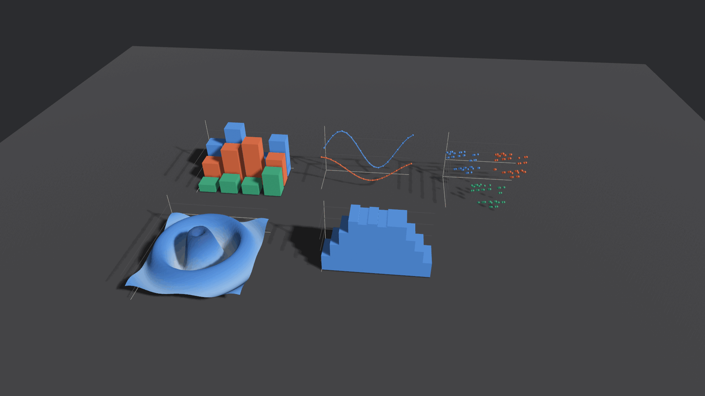

# bevy_charts

3D charts and graphs for the [Bevy](https://bevy.org) game engine.



*Bar, line, scatter, surface, and histogram charts, rendered by the `showcase`
example.*

## What this is

`bevy_charts` draws data as real geometry inside a Bevy scene — lit, shaded,
shadow-casting meshes that live in the world alongside everything else. It is not
an image you generate and blit onto a quad, and not a 2D overlay.

Charts are **plain components**. Spawn one with data and a system builds the
geometry as its children; mutate the data and it rebuilds. There is no chart
handle to hold, no renderer to tick, and nothing to tear down.

```rust
commands.spawn(BarChart3d::new(data));   // that's the whole API
```

### What it's good for

- Telemetry and analytics surfaces inside a game or simulation
- Debug and profiling views that live in the 3D world
- Data-driven props: a holographic readout, a strategy-map overlay, a lab display
- In-editor tooling built on Bevy

### What it isn't

- **A publication-quality plotting library.** For figures destined for a paper or
  a report, use [`plotters`](https://crates.io/crates/plotters) or
  [`charton`](https://crates.io/crates/charton) and render to SVG or PNG.
- **A 2D chart library.** Everything here is 3D geometry in world space.
- **Feature-complete.** See [Not yet implemented](#not-yet-implemented) — text
  labels are the big one.

### See also

[`vidi-charts`](https://crates.io/crates/vidi-charts) is another Bevy-powered
visualization crate, with a different scope and API. Worth a look if this one
doesn't fit.

## Installation

> **Not yet published to crates.io.** `cargo add bevy_charts` will not work.
> Use a git dependency:

```toml
[dependencies]
bevy_charts = { git = "https://github.com/Inhuman-Entertainment/bevy-charts" }
```

Or, working from a local checkout:

```toml
[dependencies]
bevy_charts = { path = "../bevy-charts" }
```

### Compatibility

| bevy | bevy_charts | rustc  |
| ---- | ----------- | ------ |
| 0.19 | 0.1         | 1.95+  |

Bevy makes breaking changes every release, and this crate touches meshes,
materials, hierarchy, and visibility — expect a version bump per Bevy release.

### What it pulls in

`bevy_charts` depends on `bevy` with `default-features = false`, enabling only
`bevy_asset`, `bevy_color`, and `bevy_pbr`, so your game keeps control of the
rest. The only other dependency is `plotters` with default features off, which
costs three small crates and brings no rendering backend.

## Quick start

A complete, runnable app:

```rust
use bevy::prelude::*;
use bevy_charts::prelude::*;

fn main() {
    App::new()
        .add_plugins((DefaultPlugins, BevyChartsPlugin))
        .add_systems(Startup, setup)
        .run();
}

fn setup(mut commands: Commands) {
    // A chart is geometry, so it needs a camera and a light like anything else.
    commands.spawn((
        Camera3d::default(),
        Transform::from_xyz(8.0, 6.0, 10.0).looking_at(Vec3::new(2.0, 1.5, 1.0), Vec3::Y),
    ));
    commands.spawn((
        DirectionalLight::default(),
        Transform::from_xyz(6.0, 10.0, 8.0).looking_at(Vec3::ZERO, Vec3::Y),
    ));

    commands.spawn(BarChart3d::new(
        ChartData::new()
            .with_labels(["Q1", "Q2", "Q3", "Q4"])
            .with_dataset(Dataset::new("Revenue", vec![12.0, 19.0, 7.0, 15.0])),
    ));
}
```

Seeing nothing? A chart is ordinary lit geometry, so it needs both a light and a
camera pointed at it. Charts also draw into `0..size` starting at their own
origin rather than centered on it, so a camera at the world origin ends up
*inside* the chart.

## Chart types

| Component          | Data                          | Notes                                                         |
| ------------------ | ----------------------------- | ------------------------------------------------------------- |
| `BarChart3d`       | `ChartData`                   | Categories along x, series along z. Always measured from zero. |
| `LineChart3d`      | `ChartData`                   | Polylines with optional markers; one series per depth slot.    |
| `ScatterChart3d`   | `Vec<PointDataset>`           | Points carry their own x/y/z. Cap at three series — see below. |
| `SurfaceChart3d`   | row-major height field        | Triangulated mesh; height encoded by elevation *and* color.    |
| `HistogramChart3d` | `Vec<Dataset>` of raw samples | Bins the samples, then draws them with the bar geometry.       |

`BevyChartsPlugin` adds all five. Each type also has its own plugin
(`BarChartPlugin`, `LineChartPlugin`, …) if you only want some of them — each
registers the shared resources itself, so any combination works.

### Data model

Chart.js-shaped, and deliberately plain — no `DataFrame`, no traits to implement.
Categorical charts take `ChartData` (shared labels plus parallel series):

```rust
let data = ChartData::new()
    .with_labels(["Mon", "Tue", "Wed"])
    .with_dataset(Dataset::new("Desktop", vec![12.0, 19.0, 7.0]))
    .with_dataset(Dataset::new("Mobile", vec![8.0, 14.0, 17.0]));
```

Scatter plots take `PointDataset`, whose points carry their own coordinates:

```rust
let points = vec![PointDataset::new("Samples", vec![
    Vec3::new(0.0, 1.0, 2.0),
    Vec3::new(1.0, 3.0, 0.5),
])];
```

`NaN` and infinite values are skipped rather than drawn, so you can pass sparse
data without pre-cleaning it.

## Layout

Every chart draws into the box `0..size` in its own local space, with the origin
at the bottom-left-front corner: **x** is the category axis, **y** the value axis,
**z** the series axis. Position a chart with `Transform`, size it with `ChartSize`.

## Styling

`ChartSize`, `ChartPalette`, and `AxisStyle` are [required components], so every
chart has them at defaults and any can be overridden at spawn:

```rust
commands.spawn((
    BarChart3d::new(data),
    ChartSize(Vec3::new(8.0, 4.0, 3.0)),
    ChartPalette::light(),
    AxisStyle { show_grid: false, ..default() },
));
```

[required components]: https://docs.rs/bevy/latest/bevy/ecs/component/trait.Component.html

### Series colors

`ChartPalette` ships eight categorical hues in a fixed order, with separate steps
for dark and light scene backgrounds. The **order is the colorblind-safety
mechanism**, not a cosmetic choice: adjacent slots are checked to stay
distinguishable under simulated color-vision deficiency.

Two consequences worth knowing:

- `series_color` **clamps** past the eighth slot rather than cycling, so two series
  never silently share a hue. Fold extras into an "other" series or split the chart.
- Scatter plots compare marks that are never adjacent, so they need *pairwise*
  separation, which only the **first three slots** guarantee. Past three series,
  facet into several charts.

Use `Dataset::with_color` to override a slot.

## Updating a chart

Mutating the component is all it takes — change detection triggers a rebuild:

```rust
fn push_sample(mut chart: Single<&mut LineChart3d>) {
    chart.data.datasets[0].data.push(42.0);
}
```

A rebuild despawns and respawns the chart's children, so prefer sampling a few
times a second over mutating every frame for large datasets. Both example charts
that animate do exactly that.

## Running the examples

Clone the repo and run any of these — no assets to download, nothing to
configure:

```sh
git clone https://github.com/Inhuman-Entertainment/bevy-charts
cd bevy-charts

cargo run --example showcase        # all five types at once
cargo run --example bar_chart       # grouped bars, three series
cargo run --example line_chart      # live-updating, scrolling window
cargo run --example scatter_chart   # three clusters
cargo run --example surface_chart   # animated ripple height field
```

Every example opens a window with a slowly orbiting camera — a 3D chart read from
one fixed angle is just a 2D chart with extra steps. Close the window to exit.

The first build compiles all of Bevy and takes a while; later runs are quick. For
a smoother demo, add `--release`.

**Requirements:** a GPU with Vulkan, Metal, or DX12, plus Bevy's usual Linux
dependencies (`alsa-lib`, `libudev`) if you're on Linux.

## Design notes

The library prefers reuse over novel code:

- **Axis ticks** come from [`plotters`](https://crates.io/crates/plotters)'
  `Ranged::key_points` — a proven "nice numbers" implementation. Pulled in with
  `default-features = false`, so no rendering backend comes along.
- **Bars, line segments, and markers** are all one shared unit cube or unit sphere
  placed by a `Transform`. A chart of a thousand points still holds two mesh assets.
- **Materials are cached by color**, so rebuilding a chart does not leak an asset
  per bar.
- **Only the surface chart generates real geometry**, because a height field
  genuinely needs it.

Longer rationale, including why `charton` is a planned optional feature rather
than a dependency, is in
[`openspec/changes/bootstrap-bevy-charts-plugin/design.md`](openspec/changes/bootstrap-bevy-charts-plugin/design.md).

## Not yet implemented

- **Text labels.** The big one. Axis ticks, category names, and legends are not
  drawn in 3D yet; `ChartData::labels` and `Dataset::label` are carried through
  the data model but unused at render time, so charts currently need external UI
  to be identified.
- **Stacked bars, area charts, log and time axes.**
- **Picking and tooltips.**
- **Incremental rebuilds** for large, frequently-updated datasets.

These and the rest of the known gaps are listed in [`ROADMAP.md`](ROADMAP.md).
Specifications for what already exists live in
[`openspec/specs/`](openspec/specs/), and new work should be proposed as an
OpenSpec change.

## AI co-authorship

**This library was co-authored with AI.** The initial implementation — the data
model, all five chart types, the palette, the axis and scale code, the examples,
and this README — was written by [Claude](https://claude.com/claude-code) in a
single session, directed and reviewed by a human maintainer.

What that means in practice, stated plainly so you can calibrate your trust:

- **It runs.** Every chart type in the screenshot above was rendered by the actual
  crate on real hardware, not mocked up. The build is warning-free, and 17 unit
  tests plus 7 doctests pass.
- **It was debugged by running it, not by reading it.** The first render came out
  black: in Bevy 0.19 `Mesh3d` requires only `Transform`, not `Visibility`, so the
  generated child entities were never picked up by render extraction. That
  compiles cleanly and renders nothing. It was found by building the thing and
  looking at the screen.
- **The API surface has not been battle-tested.** It has not been used in a
  shipping game, profiled under load, or exercised against adversarial data
  beyond its unit tests. Treat 0.1 as exactly that.
- **Design decisions are written down**, in `openspec/`, including the ones that
  were considered and rejected. If a choice looks wrong, the reasoning is
  recoverable rather than lost.

Bug reports and pull requests are welcome, and are held to the same bar whoever
or whatever writes them.

## License

Dual-licensed under either of

- Apache License, Version 2.0 ([LICENSE-APACHE](LICENSE-APACHE))
- MIT license ([LICENSE-MIT](LICENSE-MIT))

at your option. This matches Bevy and the wider Rust ecosystem, so the crate is
license-compatible with anything you are likely to link it against.

Unless you explicitly state otherwise, any contribution intentionally submitted
for inclusion in this crate by you shall be dual-licensed as above, without any
additional terms or conditions.
